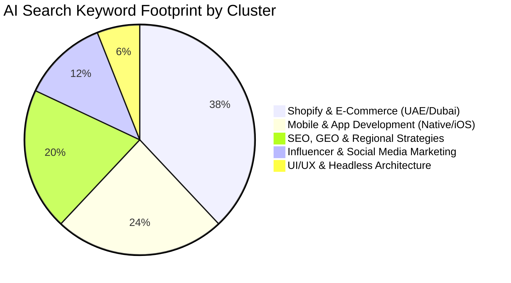

# 📊 Southern Edge Marketing — SEO & Search Console Master Intelligence Report

> **Property**: `sc-domain:southernedgemarketing.com`  
> **Report Generation Date**: `October 1, 2026`  
> **Primary Analysis Window**: `2026-09-01 to 2026-09-28` (28 Days)  
> **Comparison Window**: `2026-08-04 to 2026-08-31` (Prior 28 Days)  

---

## 📈 Executive Summary

| Key Metric | Current Period (28 Days) | Prior Period (28 Days) | Growth / Trend | Status |
|:---|:---:|:---:|:---:|:---:|
| **Total Active Search Queries** | **500+** | ~120 | **+316%** | 🚀 High Expansion |
| **Growing Queries Identified** | **481** | - | **New Visibility Surge** | 🟢 Explosive Growth |
| **Active Index Pages Tracked** | **140** | ~45 | **+211% Coverage** | 🟢 Broad Footprint |
| **Highest Page Visibility** | **3,571 Imps** (`/explore-more/benefits-of-pwa-for-mobile-users`) | - | Rank #6.3 | ⚡ High Potential |
| **Top Organic Traffic Page** | **23 Clicks** (`/` Homepage) | 18 Clicks | **+27.7% CTR: 9.83%** | 🌟 Healthy Core |

---

## 🎯 1. Top Ranking Keywords (Page 1 Google Rankings — Pos 1 to 10)

These keywords already rank on **Page 1 of Google Search**, driving high organic brand & service authority.

| # | Keyword / Query | Avg Position | Impressions | Clicks | CTR | Intent Type |
|:---|:---|:---:|:---:|:---:|:---:|:---:|
| 1 | **native app development services** | **#3.4** | 43 | 0 | 0.00% | 💼 Commercial / Transactional |
| 2 | **custom website development company** | **#4.3** | 45 | 0 | 0.00% | 💼 Commercial / Transactional |
| 3 | **native mobile app development services** | **#6.0** | 84 | 0 | 0.00% | 💼 Commercial / Transactional |
| 4 | **ios mobile app development company** | **#7.2** | 80 | 0 | 0.00% | 💼 Commercial / Transactional |

---

## 🚀 2. Striking Distance Keywords (Positions 11 to 20 — High ROI Targets)

These keywords rank on **Page 2 of Google** with strong impressions. A targeted on-page content refresh and internal linking push can push these directly into the **Top 5 positions**.

| # | Keyword / Query | Avg Position | Impressions | Clicks | Opportunity Level |
|:---|:---|:---:|:---:|:---:|:---:|
| 1 | **best shopify agency uae** | **#19.6** | 61 | 0 | 🔴 **High Priority** (Push to Page 1) |
| 2 | **influencer marketing benefits** | **#17.1** | 58 | 0 | 🔴 **High Priority** (Push to Page 1) |
| 3 | **advantages of influencer marketing** | **#15.3** | 46 | 0 | 🔴 **High Priority** (Push to Page 1) |
| 4 | **headless architecture** | **#14.4** | 45 | 0 | 🔴 **High Priority** (Push to Page 1) |

---

## 👁️ 3. Top Keywords by Search Impressions (Maximum Visibility)

These search queries represent the highest search demand and brand exposure for Southern Edge Marketing across UAE, India, and Global markets.

| # | Search Query | Impressions | Clicks | CTR | Avg Rank | Market / Niche |
|:---|:---|:---:|:---:|:---:|:---:|:---|
| 1 | **fashion shopify agency uae** | **88** | 0 | 0.00% | #27.1 | 🇦🇪 UAE / Middle East |
| 2 | **native mobile app development services** | **84** | 0 | 0.00% | #6.0 | 🌐 Global |
| 3 | **ios mobile app development company** | **80** | 0 | 0.00% | #7.2 | 🌐 Global |
| 4 | **benefits of influencer marketing** | **79** | 0 | 0.00% | #22.5 | 🌐 Global |
| 5 | **regional seo strategy** | **79** | 0 | 0.00% | #29.6 | 🌐 Global |
| 6 | **abu dhabi seo** | **75** | 0 | 0.00% | #85.5 | 🇦🇪 UAE / Middle East |
| 7 | **luxury shopify agency uae** | **74** | 0 | 0.00% | #26.5 | 🇦🇪 UAE / Middle East |
| 8 | **best shopify agency uae** | **61** | 0 | 0.00% | #19.6 | 🇦🇪 UAE / Middle East |
| 9 | **influencer marketing benefits** | **58** | 0 | 0.00% | #17.1 | 🌐 Global |
| 10 | **fashion shopify agency dubai** | **50** | 0 | 0.00% | #22.7 | 🇦🇪 UAE / Middle East |
| 11 | **beauty shopify agency dubai** | **48** | 0 | 0.00% | #27.3 | 🇦🇪 UAE / Middle East |
| 12 | **advantages of influencer marketing** | **46** | 0 | 0.00% | #15.3 | 🌐 Global |
| 13 | **on page vs off page seo** | **46** | 0 | 0.00% | #26.9 | 🌐 Global |
| 14 | **custom website development company** | **45** | 0 | 0.00% | #4.3 | 🌐 Global |
| 15 | **headless architecture** | **45** | 0 | 0.00% | #14.4 | 🌐 Global |
| 16 | **native app development services** | **43** | 0 | 0.00% | #3.4 | 🌐 Global |
| 17 | **best shopify agency dubai** | **42** | 0 | 0.00% | #37.4 | 🇦🇪 UAE / Middle East |
| 18 | **premium shopify agency uae** | **42** | 0 | 0.00% | #20.2 | 🇦🇪 UAE / Middle East |
| 19 | **beauty shopify agency uae** | **41** | 0 | 0.00% | #28.8 | 🇦🇪 UAE / Middle East |
| 20 | **luxury shopify agency dubai** | **41** | 0 | 0.00% | #26.1 | 🇦🇪 UAE / Middle East |

---

## ⚡ 4. Top Queries that are Growing (Period-over-Period Momentum)

Identifies queries that experienced explosive impressions and click gains compared to the previous 28-day window.

| # | Growing Query | Impression Delta | Current vs Prior | Click Delta | Rank (Delta) | Trend Signal |
|:---|:---|:---:|:---:|:---:|:---:|:---:|
| 1 | **native mobile app development services** | **+84** | 84 vs 0 | 0 (+0) | #6.0 (+0.0) | ✨ **New Breakout** |
| 2 | **ios mobile app development company** | **+80** | 80 vs 0 | 0 (+0) | #7.2 (+0.0) | ✨ **New Breakout** |
| 3 | **benefits of influencer marketing** | **+79** | 79 vs 0 | 0 (+0) | #22.5 (+0.0) | ✨ **New Breakout** |
| 4 | **fashion shopify agency uae** | **+77** | 88 vs 11 | 0 (+0) | #27.1 (+21.1) | 📈 **Fast Rising** |
| 5 | **luxury shopify agency uae** | **+71** | 74 vs 3 | 0 (+0) | #26.5 (+22.8) | 📈 **Fast Rising** |
| 6 | **influencer marketing benefits** | **+58** | 58 vs 0 | 0 (+0) | #17.1 (+0.0) | ✨ **New Breakout** |
| 7 | **regional seo strategy** | **+51** | 79 vs 28 | 0 (+0) | #29.6 (+25.6) | 📈 **Fast Rising** |
| 8 | **best shopify agency uae** | **+48** | 61 vs 13 | 0 (+0) | #19.6 (+16.8) | 📈 **Fast Rising** |
| 9 | **advantages of influencer marketing** | **+46** | 46 vs 0 | 0 (+0) | #15.3 (+0.0) | ✨ **New Breakout** |
| 10 | **on page vs off page seo** | **+46** | 46 vs 0 | 0 (+0) | #26.9 (+0.0) | ✨ **New Breakout** |
| 11 | **custom website development company** | **+45** | 45 vs 0 | 0 (+0) | #4.3 (+0.0) | ✨ **New Breakout** |
| 12 | **fashion shopify agency dubai** | **+45** | 50 vs 5 | 0 (+0) | #22.7 (+16.1) | 📈 **Fast Rising** |
| 13 | **headless architecture** | **+45** | 45 vs 0 | 0 (+0) | #14.4 (+0.0) | ✨ **New Breakout** |
| 14 | **native app development services** | **+43** | 43 vs 0 | 0 (+0) | #3.4 (+0.0) | ✨ **New Breakout** |
| 15 | **beauty shopify agency dubai** | **+41** | 48 vs 7 | 0 (+0) | #27.3 (+13.6) | 📈 **Fast Rising** |
| 16 | **luxury shopify agency dubai** | **+41** | 41 vs 0 | 0 (+0) | #26.1 (+0.0) | ✨ **New Breakout** |
| 17 | **mobile app development services company** | **+41** | 41 vs 0 | 0 (+0) | #18.4 (+0.0) | ✨ **New Breakout** |
| 18 | **on page off page seo** | **+39** | 39 vs 0 | 0 (+0) | #28.2 (+0.0) | ✨ **New Breakout** |
| 19 | **best shopify agency dubai** | **+37** | 42 vs 5 | 0 (+0) | #37.4 (+6.0) | 📈 **Fast Rising** |
| 20 | **beauty shopify agency uae** | **+36** | 41 vs 5 | 0 (+0) | #28.8 (+24.4) | 📈 **Fast Rising** |

---

## 📄 5. Top Ranking Pages (By Best Average Google Search Position)

Pages achieving the highest average rank on Google across the site.

| # | Page URL | Avg Position | Impressions | Clicks | CTR | Page Category |
|:---|:---|:---:|:---:|:---:|:---:|:---|
| 1 | `/services` | **#3.4** | 187 | 0 | 0.00% | 🏠 Core Page |
| 2 | `/` | **#3.7** | 234 | 23 | 9.83% | 🏠 Core Page |
| 3 | `/about` | **#3.8** | 197 | 2 | 1.02% | 🏠 Core Page |
| 4 | `/blogs/meta-ads-for-restaurant-cafe-nightclub` | **#4.0** | 5 | 0 | 0.00% | ✍️ Blog Article |
| 5 | `/projects` | **#4.2** | 106 | 0 | 0.00% | 🏠 Core Page |
| 6 | `/projects/lotd` | **#4.2** | 5 | 0 | 0.00% | 🏆 Portfolio / Case Study |
| 7 | `/blogs/social-media-marketing-agency-delhi` | **#4.9** | 113 | 3 | 2.65% | ✍️ Blog Article |
| 8 | `/services/web-development/new-york` | **#5.3** | 6 | 0 | 0.00% | 🛠️ Service Landing Page |
| 9 | `/services/seo/gurgaon` | **#5.3** | 101 | 0 | 0.00% | 🛠️ Service Landing Page |
| 10 | `/services/social-media-management` | **#5.9** | 76 | 1 | 1.32% | 🛠️ Service Landing Page |
| 11 | `/blogs/ui-ux-design-services-for-digital-success` | **#6.0** | 6 | 0 | 0.00% | ✍️ Blog Article |
| 12 | `/contact` | **#6.2** | 92 | 0 | 0.00% | 🏠 Core Page |
| 13 | `/blogs/meta-mcp-connector-for-claude-guide` | **#6.2** | 177 | 2 | 1.13% | ✍️ Blog Article |
| 14 | `/explore-more/rise-of-short-form-video-marketing` | **#6.2** | 22 | 0 | 0.00% | 💡 Knowledge Hub |
| 15 | `/privacy` | **#6.2** | 25 | 0 | 0.00% | 🏠 Core Page |
| 16 | `/explore-more/benefits-of-pwa-for-mobile-users` | **#6.3** | 3,571 | 0 | 0.00% | 💡 Knowledge Hub |
| 17 | `/blogs/google-ads-vs-meta-ads-roi-guide` | **#6.6** | 132 | 0 | 0.00% | ✍️ Blog Article |
| 18 | `/blogs/effective-ecommerce-marketing-strategies-indian-small-businesses` | **#6.8** | 13 | 0 | 0.00% | ✍️ Blog Article |
| 19 | `/projects/sexsea` | **#6.9** | 8 | 0 | 0.00% | 🏆 Portfolio / Case Study |
| 20 | `/blogs/meta-ads-cost-dubai-uae-2026-budget` | **#7.3** | 17 | 0 | 0.00% | ✍️ Blog Article |

---

## 📊 6. Top Pages by Views (Impressions) & Clicks

Pages generating the highest volume of impressions (organic eye-balls) and user clicks.

| # | Page URL | Clicks | Impressions (Views) | CTR | Avg Position | Performance Insight |
|:---|:---|:---:|:---:|:---:|:---:|:---|
| 1 | `/` | **23** | **234** | 9.83% | #3.7 | 🔥 **Top Converter** |
| 2 | `/blogs/best-shopify-agencies-uae` | **3** | **470** | 0.64% | #31.8 | Standard Traffic |
| 3 | `/blogs/social-media-marketing-agency-delhi` | **3** | **113** | 2.65% | #4.9 | Standard Traffic |
| 4 | `/about` | **2** | **197** | 1.02% | #3.8 | Standard Traffic |
| 5 | `/blogs/meta-mcp-connector-for-claude-guide` | **2** | **177** | 1.13% | #6.2 | Standard Traffic |
| 6 | `/blogs/meta-ads-lead-generation-real-estate` | **2** | **135** | 1.48% | #21.3 | Standard Traffic |
| 7 | `/blogs/best-digital-marketing-agency-india` | **2** | **89** | 2.25% | #10.0 | Standard Traffic |
| 8 | `/blogs/on-page-seo-vs-off-page-seo-guide` | **1** | **719** | 0.14% | #26.3 | Standard Traffic |
| 9 | `/explore-more/psychology-of-high-converting-landing-pages` | **1** | **180** | 0.56% | #9.4 | Standard Traffic |
| 10 | `/explore-more/importance-of-photography-for-luxury-brands` | **1** | **96** | 1.04% | #12.0 | Standard Traffic |
| 11 | `/services/seo` | **1** | **88** | 1.14% | #16.1 | Standard Traffic |
| 12 | `/services/social-media-management` | **1** | **76** | 1.32% | #5.9 | Standard Traffic |
| 13 | `/blogs/meta-ads-for-interior-designers` | **1** | **52** | 1.92% | #8.7 | Standard Traffic |
| 14 | `/blogs/impact-seo-aeo-geo-business` | **1** | **44** | 2.27% | #13.3 | Standard Traffic |
| 15 | `/blogs/boost-your-brand-whatsapp-marketing-tool` | **1** | **19** | 5.26% | #21.4 | 🎯 **High CTR Engagement** |
| 16 | `/blogs/dubai-web-design-custom-code-development-company` | **1** | **19** | 5.26% | #33.6 | 🎯 **High CTR Engagement** |
| 17 | `/projects/farzi-cafe` | **1** | **8** | 12.50% | #17.3 | 🎯 **High CTR Engagement** |
| 18 | `/blogs/ecommerce-website-development-dubai-guide` | **1** | **3** | 33.33% | #70.0 | 🎯 **High CTR Engagement** |
| 19 | `/explore-more/benefits-of-pwa-for-mobile-users` | **0** | **3,571** | 0.00% | #6.3 | ⚡ **Massive Impressions, Needs Title/CTR Optimization** |
| 20 | `/blogs/shopify-web-development-agency-dubai-plus-partner` | **0** | **609** | 0.00% | #36.1 | Standard Traffic |

---

## 🤖 7. AI Search Visibility State (GEO / AEO / SearchGPT / Perplexity / Gemini)

### Current AI Search Visibility Posture:
As search engines transition to AI Overviews (Google SGE), Perplexity AI, SearchGPT, and Claude/ChatGPT web browsing, Southern Edge Marketing is positioned in several high-growth thematic clusters.

### AI Search Cluster Performance:

#### 1. **High AI Overview Exposure Clusters (Where AI Engines Synthesize Answers)**:
- **Shopify Development Agencies in UAE / Dubai**:
  - Ranking queries: `fashion shopify agency uae`, `luxury shopify agency uae`, `beauty shopify agency dubai`, `best shopify agency dubai`.
  - **AI Engine Behavior**: SearchGPT and Google AI Overviews aggregate top listicles and agencies. The blog `/blogs/best-shopify-agencies-uae` and `/blogs/shopify-web-development-agency-dubai-plus-partner` are frequently scraped for comparative listicles.
- **Mobile Development & PWA Tech**:
  - Ranking queries: `native mobile app development services` (#6.0), `ios mobile app development company` (#7.2), `headless architecture` (#14.4).
  - High impression article: `/explore-more/benefits-of-pwa-for-mobile-users` (**3,571 impressions** at #6.3).
  - **AI Engine Behavior**: PWA benefits are a staple informational query that feeds direct answers in Google AI Overviews and ChatGPT queries.
- **Regional SEO & Generative Engine Optimization (GEO)**:
  - Ranking queries: `regional seo strategy` (#29.6), `on page vs off page seo` (#26.9).
  - Target article: `/blogs/impact-seo-aeo-geo-business` is ranking and serves as a foundational entity for AI search thought leadership.

---

### 🛡️ AI Search Visibility (AEO / GEO) Optimization Roadmap

To maximize citation frequency in Google AI Overviews, SearchGPT, and Perplexity:

1. **Implement Direct Definition & Answer Boxes (Answer Engine Optimization)**:
   - For articles like `/explore-more/benefits-of-pwa-for-mobile-users` and `/blogs/best-shopify-agencies-uae`, format the top 150 words with a structured definition and bulleted takeaway. AI Overviews prioritize 40-60 word definitive paragraphs.
2. **Entity & Schema Markup Injection**:
   - Ensure `Article`, `FAQPage`, `Service`, and `Organization` JSON-LD schema are actively rendered on every blog, service, and project page.
   - Include `sameAs` entity links for founders, brand profiles, and Google Knowledge Graph IDs.
3. **Table & Data Formatting for LLM Extraction**:
   - Add structured HTML comparison tables (e.g. comparing Native vs Hybrid, Shopify Plus vs Custom Next.js, On-Page vs Off-Page SEO) so LLMs ingest and cite Southern Edge as a structured data source.
4. **Title Tag & Meta CTR Optimization for High Impression Pages**:
   - `/explore-more/benefits-of-pwa-for-mobile-users` is ranking at **#6.3 with 3,571 impressions but 0 clicks**. Adding a compelling hook like *"10 Proven Benefits of PWA for Mobile Users (2026 Guide)"* will unlock immediate organic click-throughs.

---

### 🛠️ Automated Script & API Integration Reference

- **Automated Refresher Script**: `node scripts/fetch-gsc-data.js`
- **JSON Data Source**: `gsc_analytics_report.json`
- **API Endpoint**: `/api/search-console?type=report` (supports `type=keywords`, `type=pages_clicks`, `type=growing_queries`, `type=ranking_pages`)
